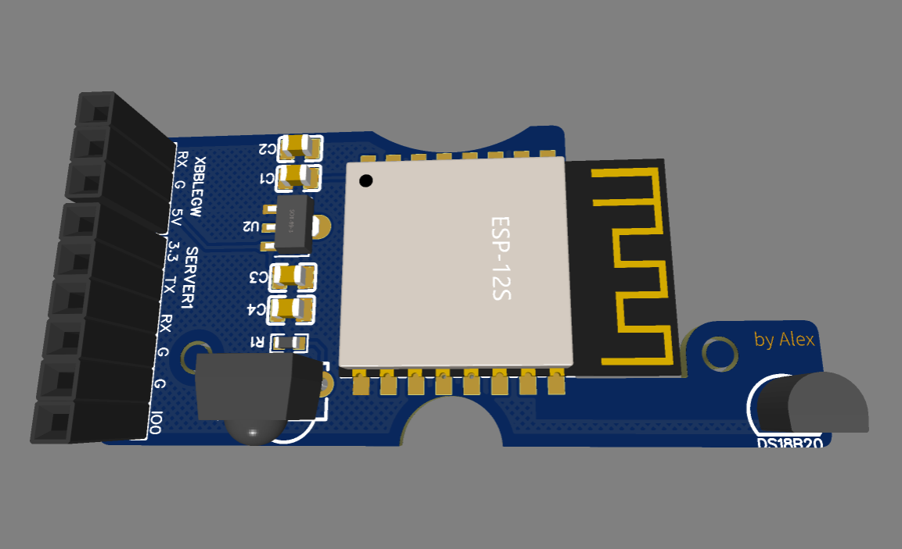
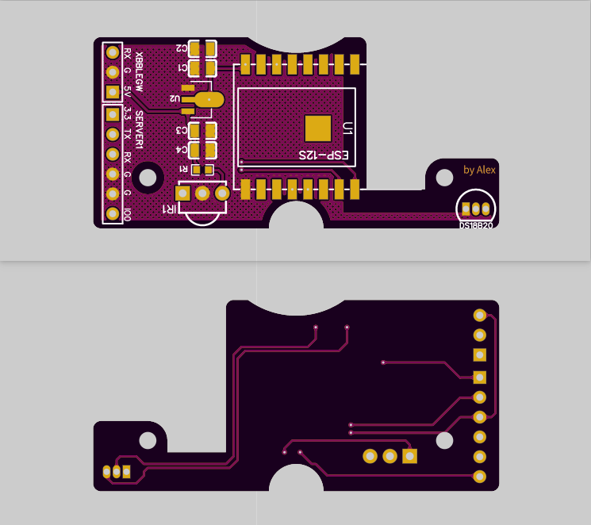

# XbBle_GW
创米小白万能遥控器（声控版）

此项目为自用pcb设计+esphome固件编译，对接蓝牙网关信息和红外信息到MQTT

https://github.com/killadm/LOCK2MQTT 拆机对接请学习K大

https://github.com/huexpub/XbBleGW Huex大佬的板子没有固件和原理图，大概参考了一下画了个简化版的pcb。

<!-- 

 -->

<!--  -->

